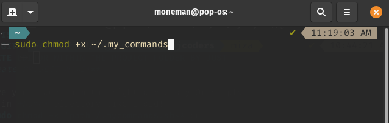

**<h1>THIS COMMANDS ARE FOR LINUX/MAC**
**IN WINDOWS YOU CAN INSTALL LINUX SHELLS**
**THIS IS SCRIPT WILL HELP YOU CREATE PROJECT FOLDER, AND CREATE GIT REPOSITORY WITH THE SAME NAME AND OPEN YOUR FAVORITE EDITOR WITHIN THE PROJECT FOLDER BY JUST TYPING</h1> *create PROJECT_NAME***

1. Make sure you place them the right directory Or simply place them in *home* Directory like I did!
2. Run **sudo chmod +x 'path'/.mycommands.sh** on Terminal or Gitbash or any shell
3. In Terminal or gitbash add this line *source ~/.my_commands.sh* to *.bashrc* or *.zshrc* FILE Replace ~/. to Your correct Path

4. Know You can type *create* 

<h4>Congra Congra</h4>